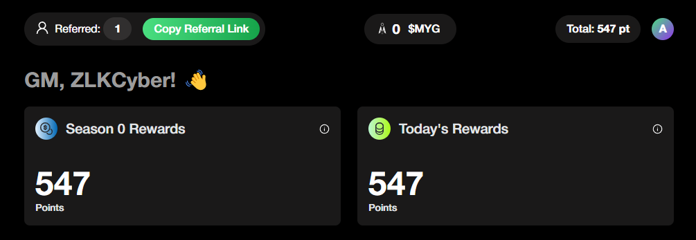
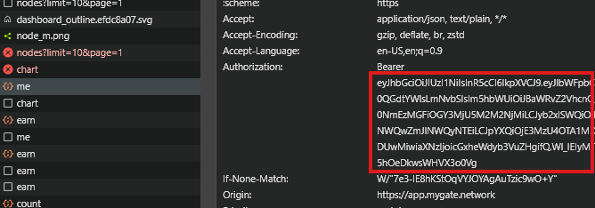

# MyGate Network Bot



## 功能特性

- **自动生成节点ID**
- **自动连接/ping节点**
- **自动重连节点**

- **支持多账户**
- **支持代理使用**
- **目前不支持一个账户创建多个节点**

## 使用前提

- 已安装Node.js
- 需要创建`tokens.txt`文件，包含my-gate平台的token，获取方法如下：
- 打开my-gate平台 [https://mygate.network/](https://app.mygate.network/login?code=RECKmF)
- 使用Gmail账号登录
- 按F12打开开发者工具，找到Network标签
- 复制token并保存到`tokens.txt`文件中

    !

## 安装步骤

1. 克隆仓库：
    ```sh
    git clone https://github.com/Zlkcyber/mygateBot.git
    cd mygateBot
    ```

2. 安装依赖包：
    ```sh
    npm install
    ```
3. 在`tokens.txt`文件中输入token，每行一个用户：
    ```sh
    nano tokens.txt
    ```
4. 可选：使用代理
- 在`proxy.txt`中粘贴代理信息，格式为`http://username:password@ip:port`
    ```sh
    nano proxy.txt
    ```
5. 运行脚本：
    ```sh
    npm run start
    ```

## 代理服务（可选）

### 免费静态住宅代理
- [WebShare](https://www.webshare.io/?referral_code=gtw7lwqqelgu)
- [ProxyScrape](https://proxyscrape.com/)
- [MonoSans](https://github.com/monosans/proxy-list)

### 付费高级静态住宅代理
- [922proxy](https://www.922proxy.com/register?inviter_code=d6416857)
- [Proxy-Cheap](https://app.proxy-cheap.com/r/Pd6sqg)
- [Infatica](https://dashboard.infatica.io/aff.php?aff=580)

### 付费动态IP代理
- [IPRoyal](https://iproyal.com/?r=733417)